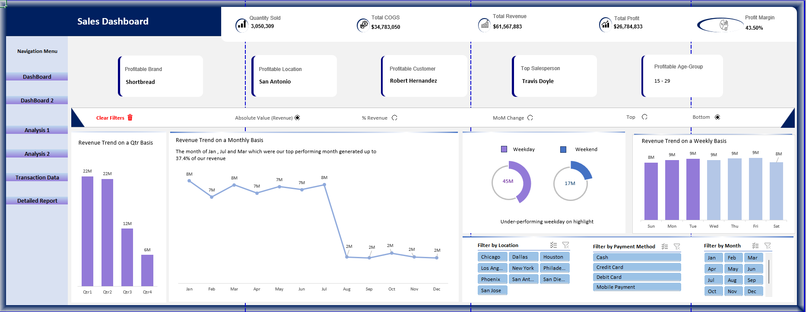

# B&J-Dashboard

## 📊 Project Overview
Designed and delivered a comprehensive sales analytics system that transformed raw transactional data into highly visual, interactive insights using SQL and Excel.  
The dashboards provide insights into revenue distribution, customer demographics, geographic performance, and profitability for the B&J Biscuit business.

## 🔑 Key Contributions
- **Data Cleaning & Preparation:** Cleaned and structured rows using SQL (joins, filters, calculated fields) to prepare analysis-ready data.  
- **Business Insights:** Answered key questions with SQL, including top revenue-generating customers, profit margin trends, and monthly vs. weekend sales performance.  
- **KPI Engineering:**  
  - Total Revenue: $61M+  
  - COGS: $34M+ 
  - Profit: $26M+  
  - Quantity Sold: 3M+ 
  - Profit Margin: 43.50%  
- **Excel Dashboarding:** Built dynamic dashboards using PivotTables, slicers, and advanced formulas (`SUMIFS`, `IF`, `XLOOKUP`, `LET`, `INDEX/MATCH`).  
- **Automation:** Used VBA to automate updates and business logic, reducing manual effort.

## 📈 Project Impact
This personal project demonstrates advanced data analytics, Excel, and SQL skills while simulating real-world business scenarios:
- **Enhanced Analytical Skills**: Practiced cleaning, transforming, and analyzing large datasets using SQL and Excel.
- **Advanced Dashboarding**: Built dynamic, interactive dashboards with PivotTables, slicers, and VBA, showcasing proficiency in Excel reporting.
- **Data Aggregation with SQL**: Used SQL queries to calculate key totals, metrics, and KPIs (revenue, COGS, profit, quantity sold, profit margin) that powered dashboards and detailed reports.
- **Simulated Business Insights**: Generated meaningful insights such as top-performing products, customer segmentation, and revenue trends.
- **Automation Practice**: Implemented Excel automation to streamline repetitive tasks, improving efficiency in data handling.
- **Portfolio Value**: Serves as a concrete example of technical and analytical abilities for potential employers or recruiters.
  
## 🖼️ Dashboard Screenshots
  
*Revenue & Customer Insights Dashboard*
  
*Profitability & Trend Analysis Dashboard*

### 📈 Detailed Reports
Detailed view of analysis results:

### 📊 Analysis Tables
Key pivot tables and analysis:
  
*Analysis Dashboard 1*

*Analysis Dashboard 2*

## 📌 Dashboard Requirements

### **Dashboard 1**
- Revenue Distribution by product price, age/gender, and payment method  
- Profitability: most profitable brand, location, customer, salesperson; overall profit margin  
- Customer Insights: top 5 customers by revenue, total customer count  
- Geographic Revenue Distribution  
- Sales Performance: quantity sold, total revenue, COGS, total profit  
- Design: user-friendly, interactive filters for location, payment method, age group  

### **Dashboard 2**
- Revenue Analysis: absolute and percentage views by product, location, and customer segment  
- Change Analysis: QoQ, MoM, WoW revenue changes with annotations  
- KPIs: quantity sold, total COGS, total revenue, total profit, profit margin  
- Interactive Features: toggle revenue views, dynamic filters for location and payment method  
- Additional Insights: annotate significant changes, compare weekdays vs. weekends  
- Design: visually engaging, numeric and percentage views  

## 🛠️ Skills & Tools
SQL · Microsoft Excel · Data Visualization · Dashboards · KPI Dashboards · Business Intelligence (BI) · VBA · Data Cleaning  

## 🖥️ How to Use the Dashboard & Program
1. **Open the Dashboards**:
Open the Excel dashboard files in the Dashboards folder. For full functionality, make sure to enable macros.
2. **Navigating the Dashboards**:
- Use filters for location, payment method, age group, or other dropdowns to dynamically update charts and pivot tables.
- Explore Revenue & Customer Insights and Profitability & Trend Analysis dashboards to see key metrics, trends, and performance indicators.
3. **Interpreting Results**:
- **KPIs**: Total Revenue, COGS, Profit, Quantity Sold, Profit Margin.
- **Dashboards**: Visualize revenue distribution, customer demographics, geographic performance, and product-level profitability.
- **Analysis Tables**: Explore detailed pivot tables for trends, comparisons (QoQ, MoM, WoW), and insights into top-performing products or customers.
4. **Detailed Reports**:
- Use the Detailed Report file to see comprehensive data and calculated results.
- Use it in conjunction with dashboards to drill down into specifics of sales performance and revenue trends.

## ⚠️ Important Note
**The Excel dashboard files are large and may not preview in GitHub.**  
Please **download** the following files to view the dashboards properly:  
- `Sales Dashboard Project Detailed - Official.xlsm`  
- `B&J Biscuit Dataset.xlsx`  
Open in **Excel Desktop** for full interactivity, including PivotTables, slicers, and macros.

### 📂 Project Files
- **Dashboard**: Interactive Excel dashboards with PivotTables, slicers, and charts visualizing revenue, profitability, and sales trends.
- **Data**: Raw sales data (e.g., B&J Biscuit Dataset.xlsx) used for all analyses.
- **Documentation**: Project requirements, methodology explanations, and additional documentation.
- **Images**: Screenshots of dashboards, analysis tables, and detailed reports used for README visualization.
- **SQL**: Contains all SQL queries used for cleaning, aggregating, and analyzing raw sales data. These queries not only supported the creation of dashboards and detailed reports but also calculated key totals and numbers such as revenue, COGS, profit, quantity sold, and profit margins.
- **VBA**: Contains macros used to clear slicers and to automate report generation, including the **Sales Summary Report**, which consolidates key metrics, tables, and summary statistics into a dedicated Excel sheet.
